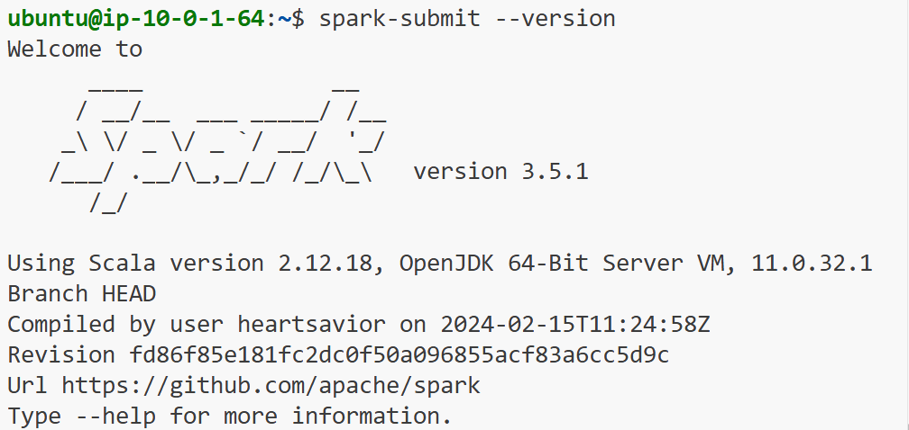
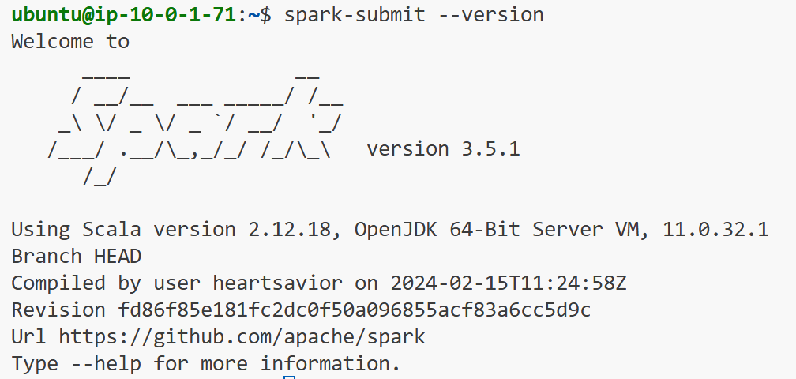
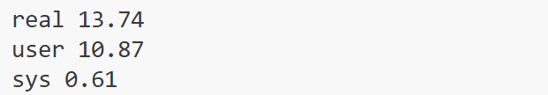
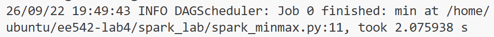

# EE 542 - Lab4
# Part 1 — AWS Environment and Hadoop Setup

## 1.1 AWS EC2 Configuration

Two AWS EC2 instances were created to build a Hadoop cluster.

| Configuration | Master | Worker |
|---|---|---|
| Instance Name | EE542-Lab4-Hadoop-Master | EE542-Lab4-Hadoop-Worker |
| Instance Type | t2.medium | t2.medium |
| Operating System | Ubuntu 22.04.5 LTS | Ubuntu 22.04.5 LTS |
| Private IP | 10.0.1.64 | 10.0.1.71 |
| Java Version | OpenJDK 11 | OpenJDK 11 |
| Hadoop Version | 3.3.6 | 3.3.6 |
| Hadoop Directory | `/usr/local/hadoop` | `/usr/local/hadoop` |

Both instances were deployed in the same AWS VPC and subnet.

A dedicated security group, `EE542-Lab4-Hadoop-SG`, was configured to allow SSH access and internal communication between cluster nodes.

The private network connection was verified using `ping` in both directions.

## 1.2 Java and Hadoop Installation

Java 11, SSH, and rsync were installed on both instances:

```bash
sudo apt update
sudo apt install -y openjdk-11-jdk ssh rsync
```

Hadoop 3.3.6 was downloaded and installed under:

```text
/usr/local/hadoop
```

The following environment variables were configured:

```bash
export JAVA_HOME=/usr/lib/jvm/java-11-openjdk-amd64
export HADOOP_HOME=/usr/local/hadoop
export PATH=$PATH:$HADOOP_HOME/bin:$HADOOP_HOME/sbin
```

The Java path was also configured in:

```text
/usr/local/hadoop/etc/hadoop/hadoop-env.sh
```

Installation was verified using:

```bash
java -version
hadoop version
```

Both nodes successfully ran Hadoop 3.3.6 with Java 11.

## 1.3 Hadoop Configuration

The Hadoop configuration files were updated:

| Configuration File | Purpose |
|---|---|
| `core-site.xml` | Configure the default HDFS address |
| `hdfs-site.xml` | Configure HDFS storage and replication |
| `mapred-site.xml` | Enable MapReduce execution through YARN |
| `yarn-site.xml` | Configure the ResourceManager and shuffle service |
| `workers` | Define the Hadoop worker nodes |

The NameNode and ResourceManager were configured on the Master:

```text
NameNode:        10.0.1.64:9000
ResourceManager: 10.0.1.64
```

HDFS replication was set to:

```text
dfs.replication = 1
```

The initial single-node configuration used:

```text
workers:
localhost
```

SSH key-based authentication was configured so that the Master could start Hadoop services without interactive password prompts.

HDFS and YARN were started using:

```bash
/usr/local/hadoop/sbin/start-dfs.sh
/usr/local/hadoop/sbin/start-yarn.sh
```

The initial single-node deployment was verified with:

```bash
hdfs dfsadmin -report
yarn node -list
```

The results confirmed:

```text
Live datanodes (1)
Total Nodes: 1
Node State: RUNNING
```

---

# Part 2 — Python MapReduce and Single-Node Evaluation

## 2.1 Gutenberg Dataset

Two books from Project Gutenberg were downloaded and used as the experimental dataset.

| File | Size (bytes) | Lines |
|---|---:|---:|
| `pg1342.txt` | 772,386 | 14,915 |
| `pg84.txt` | 448,885 | 7,741 |
| **Total** | **1,221,271** | **22,656** |

The files were uploaded to HDFS:

```bash
hdfs dfs -mkdir -p /gutenberg
hdfs dfs -put pg1342.txt pg84.txt /gutenberg/
```

The HDFS input directory was:

```text
/gutenberg/
├── pg1342.txt
└── pg84.txt
```

The same dataset was retained throughout the single-node and two-node experiments.

## 2.2 Python MapReduce Implementation

Three Python MapReduce tasks were implemented using Hadoop Streaming.

| Task | Python Files | Purpose |
|---|---|---|
| Word Count | `wordcount_mapper.py`, `wordcount_reducer.py` | Count the frequency of each word |
| Min/Max Word Count | `minmax_reducer.py` | Find the minimum and maximum word frequencies |
| Character Count | `char_mapper.py`, `char_reducer.py` | Count individual character frequencies |

### Word Count

The mapper reads each line and emits a key-value pair for each word:

```text
word    1
```

The reducer aggregates all values associated with each word.

The implementation uses whitespace-based tokenization, so punctuation and capitalization are preserved.

### Min/Max Word Count

Min/Max was implemented as a second MapReduce stage.

It reads the aggregated output of Word Count and identifies the words with the lowest and highest frequencies.

Processing pipeline:

```text
Gutenberg Text
      |
      v
  Word Count
      |
      v
Aggregated Word Frequencies
      |
      v
   Min / Max
```

The reported Min/Max execution time includes only the second stage, not the preceding Word Count job.

### Character Count

A new Python mapper and reducer were implemented to count individual characters.

Characters are represented using Unicode code points to preserve spaces and punctuation in the Hadoop output.

For example:

```text
U+0020    Space
U+0041    A
U+0061    a
```

The implementation distinguishes uppercase and lowercase characters and excludes line-ending characters.

## 2.3 Single-Node Performance Results

All three tasks were successfully executed on the Master-only Hadoop configuration.

| MapReduce Task | Execution Time (s) | Output |
|---|---:|---|
| Word Count | 30.22 | 21,419 records |
| Min/Max Word Count | 24.49 | 2 records |
| Character Count | 29.27 | 101 character records |

Execution time was measured using:

```bash
/usr/bin/time -p
```

The `real` value was recorded as the total elapsed time.

### Word Count Results

The Word Count job processed 22,656 input lines and generated 21,419 output records.

The output was saved to:

```text
/output_wordcount_1node
```

### Min/Max Results

| Result | Word | Frequency |
|---|---|---:|
| Minimum | `#1342]` | 1 |
| Maximum | `the` | 8,577 |

Output directory:

```text
/output_minmax_1node
```

Multiple words may share the minimum frequency. The reducer retains the first minimum encountered.

### Character Count Results

The Character Count task produced frequency records for 101 distinct characters.

Representative results:

| Unicode | Character | Frequency |
|---|---|---:|
| U+0020 | Space | 197,874 |
| U+002C | Comma | 15,100 |
| U+002E | Period | 9,826 |
| U+0041 | A | 1,116 |
| U+0061 | a | 7,074 |

Output directory:

```text
/output_charcount_1node
```

The results demonstrate that the program counts spaces and punctuation in addition to letters, while distinguishing uppercase and lowercase characters.

---

# Part 3 — Two-Node Hadoop Scaling and Performance Evaluation

## 3.1 Expanding Hadoop to Two Nodes

After completing the single-node baseline, the Worker was added to the existing Hadoop cluster.

The following configuration was used:

| Hadoop Service | Master | Worker |
|---|---|---|
| NameNode | Yes | No |
| DataNode | Yes | Yes |
| ResourceManager | Yes | No |
| NodeManager | Yes | Yes |
| SecondaryNameNode | Yes | No |

The Hadoop XML configuration files were synchronized from the Master to the Worker.

The Master's `workers` file was updated to:

```text
localhost
10.0.1.71
```

HDFS and YARN were restarted without reformatting the existing NameNode.

The existing Gutenberg dataset and single-node results were preserved.

## 3.2 Two-Node Cluster Verification

HDFS successfully recognized both DataNodes:

```text
Live datanodes (2):

Name: 10.0.1.64:9866
Name: 10.0.1.71:9866
```

YARN also recognized two running NodeManagers:

```text
Total Nodes: 2

ip-10-0-1-64    RUNNING
ip-10-0-1-71    RUNNING
```

This confirmed that both nodes had joined the HDFS and YARN cluster.

The registration checks establish that both nodes were available to the cluster. Per-task placement records were not obtained, so they do not independently prove that every job used both nodes for computation.

## 3.3 Two-Node MapReduce Experiments

The three MapReduce tasks were rerun using the same Gutenberg dataset, Python programs, and reducer settings.

Separate HDFS output directories were used to preserve the single-node results.

| Task | Two-Node Output Directory |
|---|---|
| Word Count | `/output_wordcount_2nodes` |
| Min/Max Word Count | `/output_minmax_2nodes` |
| Character Count | `/output_charcount_2nodes_retry1` |

All three jobs completed successfully in the final two-node configuration.

The Word Count and Character Count outputs were compared against the corresponding single-node outputs using `diff -q`.

No differences were reported.

The Min/Max results were also identical across the two configurations.

## 3.4 Performance Comparison

### Hadoop MapReduce: Single Node vs Two Nodes

| MapReduce Task | Single Node (s) | Two Nodes (s) | Difference (s) |
|---|---:|---:|---:|
| Word Count | 30.22 | 33.45 | +3.23 |
| Min/Max Word Count | 24.49 | 24.97 | +0.48 |
| Character Count | 29.27 | 28.71 | -0.56 |

**Notes:**

- Positive differences indicate that the two-node run took longer.
- Negative differences indicate that the two-node run took less time.
- Min/Max measures only the second processing stage.
- Each value represents one successful run under the corresponding configuration.
- The dataset and Python implementations remained unchanged.

### Observations

Word Count took 30.22 seconds on one node and 33.45 seconds on two nodes.

Min/Max Word Count remained nearly unchanged, increasing from 24.49 to 24.97 seconds.

Character Count decreased slightly from 29.27 to 28.71 seconds.

For this approximately 1.2 MB dataset, the two-node configuration did not show a substantial overall performance improvement.

A possible explanation is that task startup, scheduling, and distributed communication overhead can offset the benefits of parallel processing when the input dataset is small.

Additional repeated runs and task-placement verification would be useful before drawing broader conclusions about scaling performance.

---

## 3.5 Troubleshooting

Two main issues were encountered while configuring and testing the two-node cluster.

### Issue 1 — Worker DataNode Registration Failure

Initially, the Worker DataNode process started but did not successfully register with the NameNode.

The Worker log reported:

```text
Datanode denied communication with namenode
because hostname cannot be resolved
```

The problem was addressed by configuring hostname resolution for the Worker on the Master.

After restarting HDFS, both DataNodes were successfully recognized.

### Issue 2 — MapReduce Container Launch Failure

The first two-node Character Count attempt failed with:

```text
java.net.UnknownHostException: ip-10-0-1-64
```

The issue was traced to hostname resolution between the two instances.

Both instances were configured with private IPv4 hostname mappings:

```text
10.0.1.64 ip-10-0-1-64
10.0.1.71 ip-10-0-1-71
```

After verifying hostname resolution, the Character Count job was rerun successfully.

The successful retry completed in 28.71 seconds, and its output matched the single-node result.

The failed attempt was excluded from the performance comparison.

---

## 4. Setting up Spark on AWS EC2

Apache Spark 3.5.1 was installed on the EC2 instance. The Spark environment variables were configured in `.bashrc`:

```bash
export SPARK_HOME=/opt/spark
export PATH=$PATH:$SPARK_HOME/bin
```

The installation was verified using:

```bash
spark-submit --version
```

Spark started successfully with Java 11.

Master:



Worker:



---

## 5. Spark with Python (PySpark)

Three PySpark programs were implemented using the Gutenberg text files.

### 5.1 Word Count

`spark_wordcount.py` counts the frequency of each word using `flatMap`, `map`, and `reduceByKey`.

```bash
spark-submit spark_wordcount.py
```

The program successfully processed the input files and generated the word-count output.

**Execution time:** 2.33 s



### 5.2 Character Frequency

`spark_charcount.py` counts the frequency of each character in the Gutenberg dataset.

```bash
spark-submit spark_charcount.py
```

The output contains each character and its total frequency.

**Execution time:** 2.64 s


### 5.3 Minimum and Maximum Word Count

`spark_minmax.py` calculates the least and most frequently occurring words.

```bash
spark-submit spark_minmax.py
```

Result:

```text
MIN: ('www.gutenberg.org/ebooks/1342', 1)
MAX: ('the', 8577)
```


**Execution time:** 2.075938 + 0.291528 ≈ 2.37 s




## 6. Performance Comparison

Hadoop and Spark were tested on both one-node and two-node configurations using the same Gutenberg dataset.

### 6.1 Execution Time

| Task               | Hadoop 1 Node | Hadoop 2 Nodes | Spark 1 Node | Spark 2 Nodes |
| ------------------ | ------------: | -------------: | -----------: | ------------: |
| Word Count         |         ___ s |          ___ s |        2.33 s |         4.85 s |
| Character Count    |         ___ s |          ___ s |        2.64 s |         4.65 s |
| Min/Max Word Count |         ___ s |          ___ s |        2.37 s |         4.94 s |

### 6.2 Discussion

**1. Which framework executed faster on one node? On two nodes?**

[Insert answer based on measured execution times.]

**2. Which framework is easier to implement in Python?**

Spark was easier to implement in Python because PySpark provides high-level operations such as `flatMap`, `map`, and `reduceByKey`, while Hadoop requires separate mapper and reducer programs.

**3. How does Spark's in-memory processing affect performance compared to Hadoop?**

Spark can keep intermediate data in memory and reduce repeated disk I/O. This can improve performance compared with Hadoop MapReduce, especially for larger or repeated computations. For small datasets, cluster setup and communication overhead may reduce this advantage.
